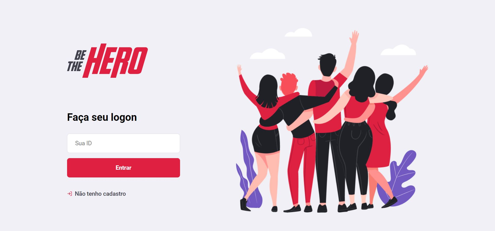

<h1 align="center">
    
</h1>

<h4 align="center">
  🚀 Semana OmniStack 11.0
</h4>

  

## 💻 Projeto

O BeTheHero é um projeto que visa conectar pessoas que desejam fazer contribuições monetárias a ONG's (Organizações não governamentais) que precisam de ajuda.

## :rocket: Tecnologias

Esse projeto foi desenvolvido com as seguintes tecnologias:

- [Node.js](https://nodejs.org/en/)
- [React](https://reactjs.org)
- [React Native](https://facebook.github.io/react-native/)
- [Expo](https://expo.io/)

## 🔖 Layout

Feito com ♥ by Rocketseat :wave: [Participe da nossa comunidade!](https://discordapp.com/invite/gCRAFhc)